# Crowd-Analysis-by-Face-Recognition-and-Expression-Detection

**Authors : Akanksha Diwedy, Akarsh Dang, Anthony Prajwal Prakash, Harsh Waghela, Naren Divvala**

Research has shown that over 90% of our communication can be non-verbal, but technology has struggled to keep up, and traditional code is generally bad at understanding our intonations and intentions. 
Contextual emotion has widespread consequences for society and business. Businesses can use the model to understand their customers and create products that people like. In the public sphere, government organizations could make good use of the ability to detect emotions like guilt, fear, and uncertainty. Face identification and Expression recognition have been explored independently. Our project presents a hybrid model of face recognition and expression detection for analyzing crowd behaviour. Many theoretical models discussed this possibility and its effects on the accuracy of the classification, but they were not backed by practical or experimental figures. We saw a challenge in this scenario which was aligned with our interest in Computer Vision, helping us explore multiple capabilities and understand the true power of CNN’s.

## Previous Works and Comparison
The most traditional and extensively used algorithms in the research of face recognition and emotion detection are PCA, SVM and Linear Discriminant Analysis (LDA). 

    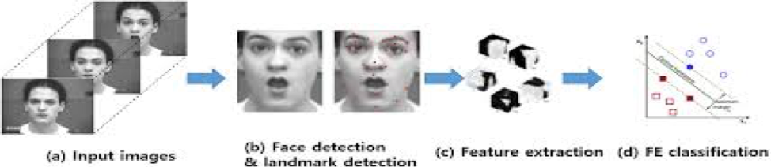

In recent decades, deep-learning algorithms have been applied to the field of computer vision, including CNN and recurrent neural network (RNN). 
Most approaches deal with each task independently, however there are no successful models that predict both identity and expression of a person simultaneously with  high accuracy.

## Problem Formulation
We aim to successfully design a Multi-Label Convolutional Neural Network which performs two tasks:
* Detecting the emotion on a person's face from one of five universal expressions (i.e. happy, sad, anger, surprise and neutral) 
* Recognize the identity of the person 

    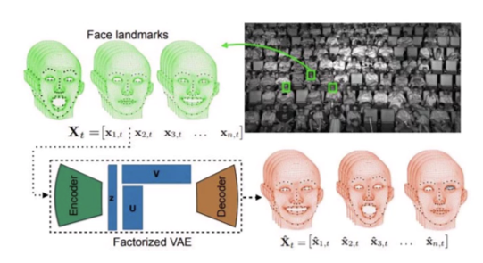

The applications of the proposed approach ranges from analyzing class reactions to understanding customer satisfaction. For example, Disney recently used expression analysis to better understand audience reactions for movies like Star Wars: The Force Awakens and the jungle book. Even Facebook began implementing facial recognition functionality that helped identify people whose faces may be featured in the photos. Now, more than 350 million photos are uploaded and tagged using face recognition each day. 

## Data and Data Preprocessing

    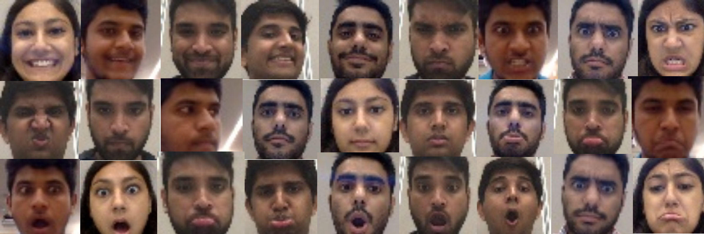

One of the biggest challenges for our project was building a good dataset over which we could draw conclusions. We curated our own dataset of over 5000 images captured in different lighting conditions and orientations encompassing 5 subjects and 5 universal expressions. With the end goal of performing analysis on a real-time feed, we built out training dataset by capturing images from a webcam. Face detection was used to identify the individuals in the frame and the subjects face was resized to a color resolution of 48x48. The image was then normalized. To increase the learning of our model and avoid over-fitting, we used data augmentation to increase the number of training examples using operations like horizontal flip, rotation and zooming. One-hot encoding was used to transform labels to vectors.

    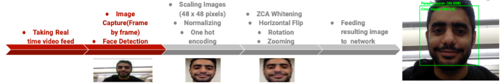

## Approach
As Face Recognition and Expression Detection involve learning some common features of the human face, we have proposed a model that uses shared layers to identify and learn these features. In addition to these shared layers, our model contains parameters independent to each task. We used two separate Loss Functions for each task. Our network then trains by using the Adam Optimizer to minimize the sum of the two losses.

We used Softmax with Categorical Cross entropy as our loss function because its proven to work well with Multi-Label classification. Using this loss, we train a CNN to output a probability over five expressions in addition to the subjects identity.

    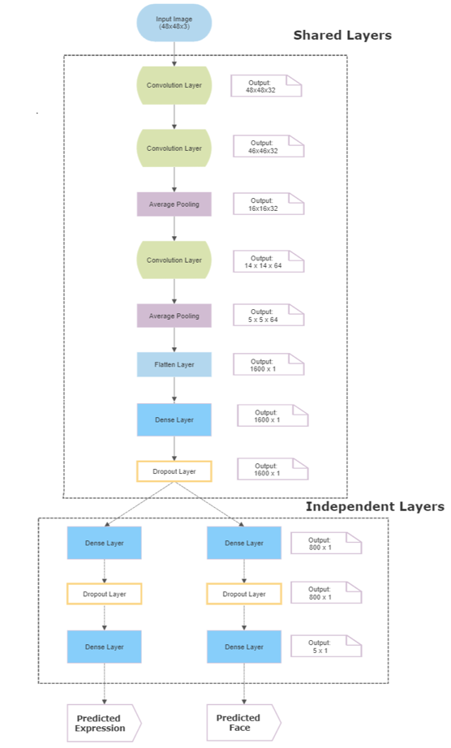

For the training dataset, we achieved a Face prediction accuracy of 99.93%.

    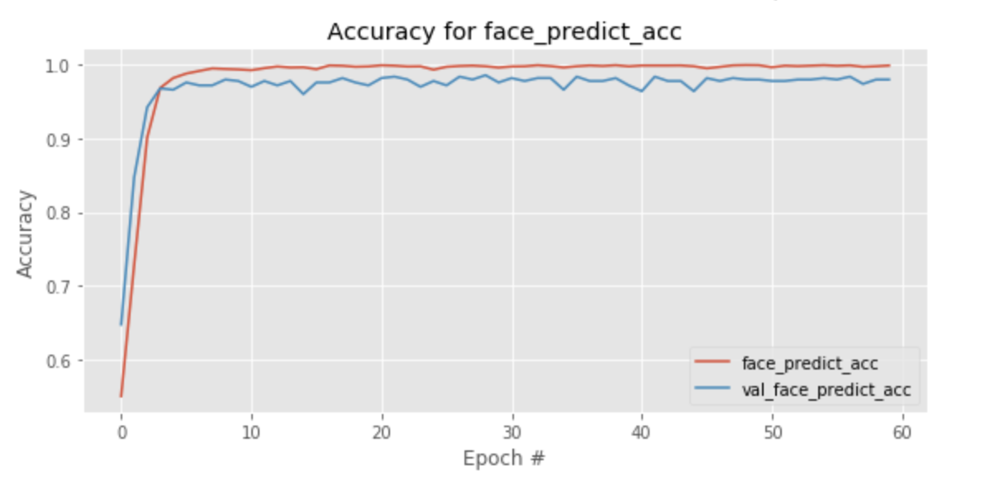

For the training dataset, we achieved an Expression prediction accuracy of 99.54%.

    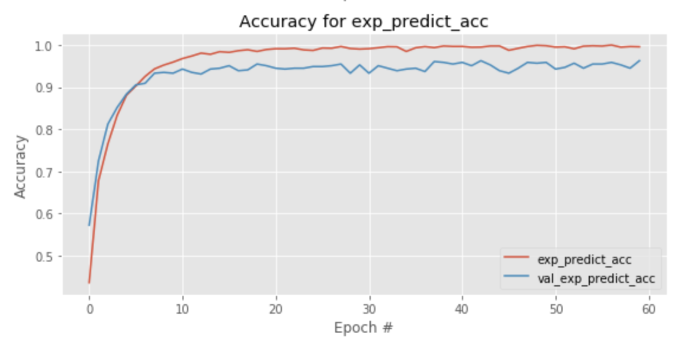

## Results
The model performed well on test data achieving an accuracy of 94% for face prediction and 89% for expression prediction. The shared model approach achieved the following accuracy for training, validation and test datasets. 

    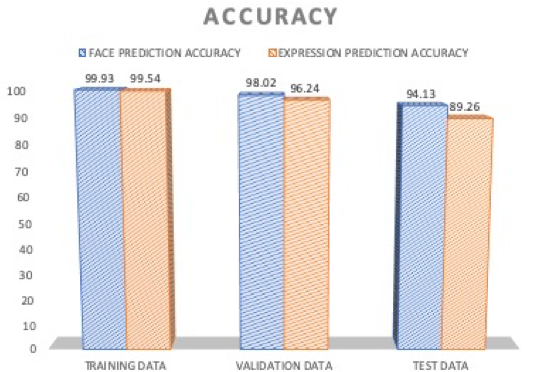

The performance of the test data was evaluated using Precision, Recall and F1-score. Our observations can be summarized as below.

    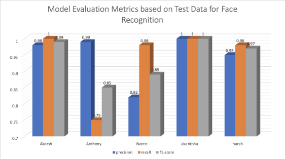
    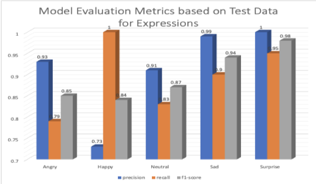

We had the following observations with our model :
* We began by comparing the pros and cons of using a separate network for each of the two tasks to using a single network performing multi-label classification. We concluded that we can achieve comparable accuracy with fewer parameters using shared layers.
* We observed that the model can be sensitive to hue, saturation and brightness. Thus, we trained the model with the images captured in different lighting conditions.
* We observed the effect of different epoch values on the model’s accuracy. Optimal performance was achieved by early stopping at the 50 epoch mark.
* Surprise and Sad are the easiest expression to identify for our model. 
* Other expressions were mostly incorrectly predicted as Happy in the testset, giving the lowest precision value of 0.73 for Happy. 
* High precision was observed for all our subjects and Akanksha’s identity was most easily recognizable by the model. 
* Anthony was the subject with most incorrect predictions having 127 misclassified images. 

The below tables help us visualize the misclassifications made by the model on test data. 

    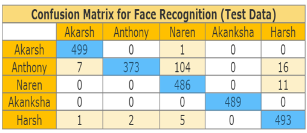
    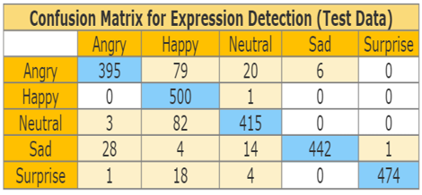

Our model successfully predicts the identity and expression of a subject with high accuracy. In the future we plan on Improving our dataset by capturing images of more expressions such as fear, disgust, contempt etc. Also enabling our model to categorize unidentified subjects to an ‘unknown’ class. This can also be extended to learning the body language of subjects which can give a better understanding of a crowd’s behaviour.

    

## References

* CPU Real Time face detection - Towards Data Science (https://towardsdatascience.com/faced-cpu-real-time-face-detection-using-deep-learning-1488681c1602)
* Multi-label classification with Keras - PyImageSearch (https://www.pyimagesearch.com/2018/05/07/multi-label-classification-with-keras/)
* Introduction to Emotion Recognition - Algorithmia blog (https://blog.algorithmia.com/introduction-to-emotion-recognition/)
* Octavio Arriaga, Paul G. Ploger, Matias Valdenegro: Real-time Convolution Neural Networks for Emotion and Gender Classification
* A Brief Review of Facial Emotion Recognition Based on Visual Information (https://www.ncbi.nlm.nih.gov/pmc/articles/PMC5856145/)
* How brands are using emotion-detection technology (https://econsultancy.com/how-brands-are-using-emotion-detection-technology/)

